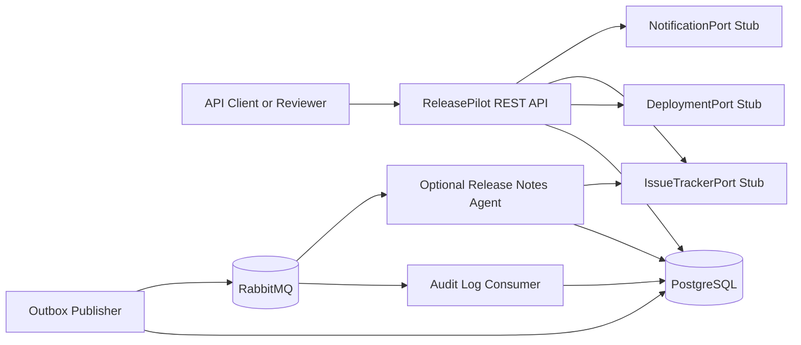
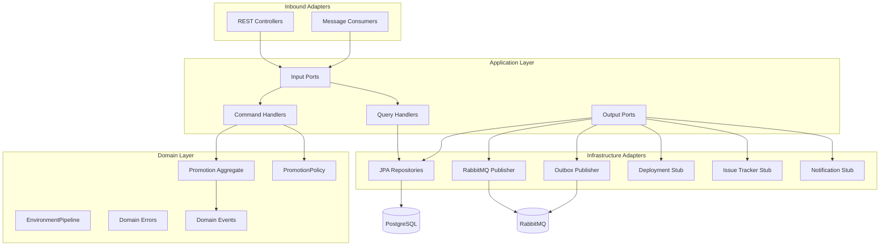
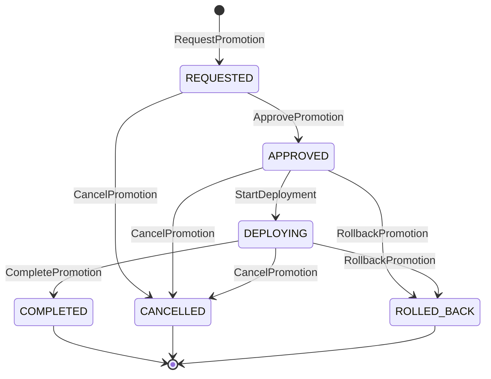
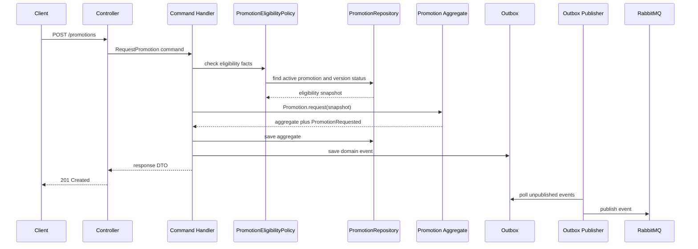
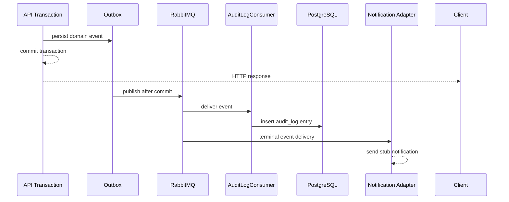
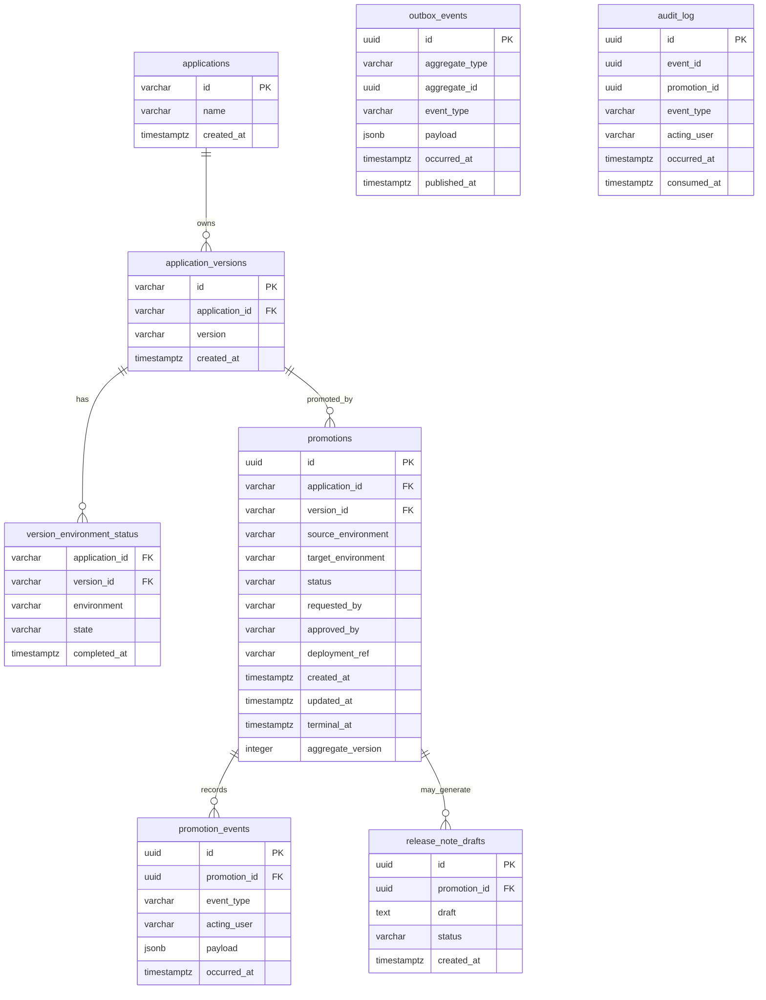
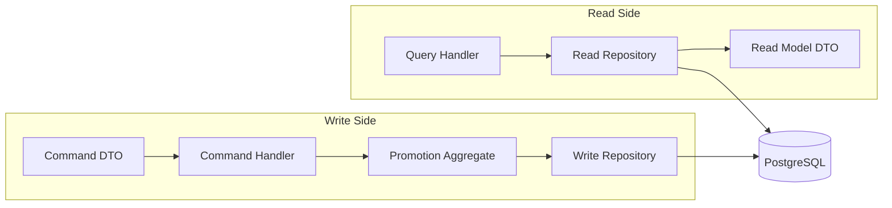
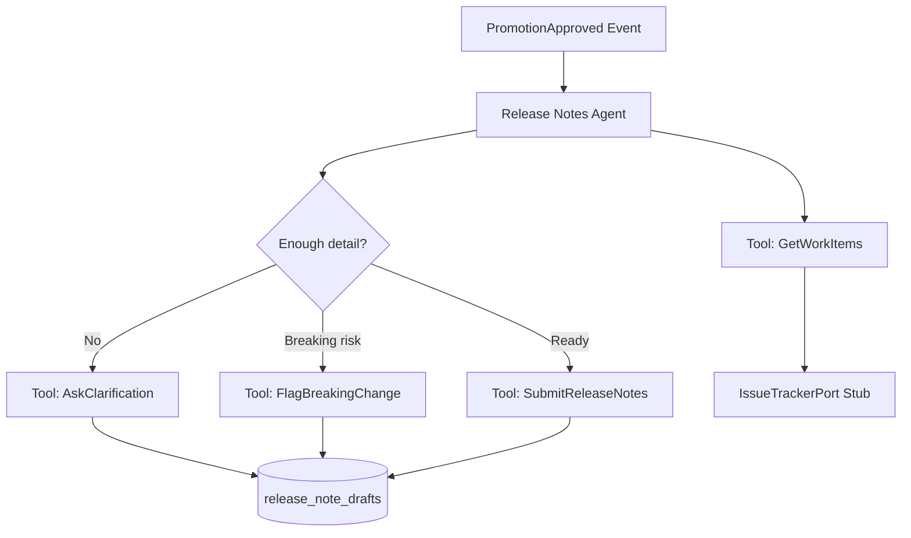

# ReleasePilot Challenge Architecture

Source: The Agile Monkeys ReleasePilot backend challenge page, fetched on 2026-07-02.

## Executive Summary

ReleasePilot is a Java REST backend for managing how application versions move through deployment environments. The central domain concept is a `Promotion`: an aggregate that moves one application version exactly one step through `dev -> staging -> production`.

The architecture should demonstrate senior backend judgment more than feature volume. The recommended implementation is a Spring Boot 3 service using DDD tactical patterns, CQRS command/query separation, hexagonal ports/adapters, PostgreSQL persistence, RabbitMQ event delivery, and an asynchronous audit consumer.

## Architectural Goals

- Keep business rules in the domain/application core, not controllers.
- Make the Promotion lifecycle explicit and testable.
- Separate commands from queries.
- Publish every domain event to a queue.
- Process audit logs asynchronously after API responses.
- Define external system integrations as ports with stub adapters.
- Keep the implementation small enough to finish, but complete enough to discuss.

## Recommended Stack

| Concern | Choice | Rationale |
| --- | --- | --- |
| Language | Java 21 | Modern Java, records, sealed types if useful, strong interview fit |
| Framework | Spring Boot 3 | Fast REST, validation, Problem Details, Actuator, messaging integration |
| Build | Gradle | Common Java challenge setup |
| Database | PostgreSQL | Transactional constraints and realistic persistence |
| Queue | RabbitMQ | Simple local queue with Docker Compose and Spring AMQP |
| Migrations | Flyway | Repeatable schema setup |
| Tests | JUnit 5, AssertJ, Mockito, Testcontainers | Domain, API, DB, and messaging verification |
| Docs | Markdown plus Mermaid | Easy to review in repo |

## System Context



## Hexagonal Architecture



### Layer Rules

- Domain depends on nothing outside the domain package.
- Application depends on domain and port interfaces.
- Infrastructure implements application output ports.
- REST controllers call application input ports or command/query handlers.
- JPA entities are infrastructure details and are not returned by the API.

## Bounded Contexts

For this challenge, a single deployable service is enough. Internally, split by domain responsibility:

| Context | Responsibility |
| --- | --- |
| Promotion | Promotion lifecycle, state machine, domain events |
| Application Catalog | Applications, versions, environment completion status |
| Audit | Durable event audit log consumed asynchronously |
| Release Notes Agent | Optional stretch context triggered by approval |

## Package Structure

```text
com.releasepilot
  promotion
    domain
      Promotion.java
      PromotionStatus.java
      Environment.java
      EnvironmentPipeline.java
      PromotionEvent.java
      DomainError.java
    application
      command
        RequestPromotionHandler.java
        ApprovePromotionHandler.java
        StartDeploymentHandler.java
        CompletePromotionHandler.java
        RollbackPromotionHandler.java
        CancelPromotionHandler.java
      query
        GetPromotionQueryHandler.java
        GetApplicationStatusQueryHandler.java
        ListApplicationPromotionsQueryHandler.java
      port
        in
        out
          PromotionRepository.java
          ApplicationVersionStatusRepository.java
          DomainEventPublisher.java
          DeploymentPort.java
          IssueTrackerPort.java
          NotificationPort.java
          ApproverDirectory.java
    infrastructure
      web
      persistence
      messaging
      adapters
  catalog
    domain
    application
    infrastructure
  audit
    application
    infrastructure
  releasenotes
    application
    infrastructure
```

## Domain Model

### Core Concepts

| Concept | Description |
| --- | --- |
| `Application` | Deployable product or service |
| `ApplicationVersion` | Version label belonging to an application |
| `Environment` | Ordered enum: `DEV`, `STAGING`, `PRODUCTION` |
| `EnvironmentPipeline` | Domain service/value object that validates next-step movement |
| `Promotion` | Aggregate representing one movement of one version to one target environment |
| `PromotionEvent` | Domain event emitted by successful state transitions |
| `AuditLogEntry` | Async persisted record of a domain event |

### Promotion Aggregate Responsibilities

The aggregate should own:

- Valid state transitions.
- Terminal immutability.
- Acting user on transitions.
- Event creation.
- Deployment reference assignment during deployment start.
- Rejection of commands that do not make sense for the current status.

The aggregate should not own:

- HTTP status mapping.
- Database queries.
- Queue publishing.
- External deployment mechanics.
- Cross-aggregate lookup by itself.

### Cross-Aggregate Rules

Two challenge rules require facts outside a single Promotion instance:

- A version must complete the previous environment before promotion to the next environment.
- Only one promotion may be in progress per application plus target environment.

Recommended handling:

- Use an application/domain policy, `PromotionEligibilityPolicy`, to gather current facts from repositories.
- Pass an immutable eligibility snapshot into `Promotion.request(...)`.
- Let `Promotion.request(...)` reject invalid eligibility.
- Add a partial unique database index for active promotions by `(application_id, target_environment)`.
- Run the request command transactionally.

This keeps the aggregate from becoming a database service while still making the domain model the place where invalid promotion creation is rejected.

## Promotion State Machine



### State Rules

| Current State | Allowed Commands | Notes |
| --- | --- | --- |
| None | `RequestPromotion` | Creates a new aggregate |
| `REQUESTED` | `ApprovePromotion`, `CancelPromotion` | Approval requires approver |
| `APPROVED` | `StartDeployment`, `RollbackPromotion`, `CancelPromotion` | Approval can trigger optional release notes |
| `DEPLOYING` | `CompletePromotion`, `RollbackPromotion`, `CancelPromotion` | Deployment reference should exist |
| `COMPLETED` | None | Immutable |
| `CANCELLED` | None | Immutable |
| `ROLLED_BACK` | None | Treat as terminal immutable |

## Command API

Use resource-oriented URLs with command endpoints for transitions. This keeps the lifecycle explicit and easy to document.

| Command | Endpoint | Success |
| --- | --- | --- |
| Request promotion | `POST /promotions` | `201 Created` |
| Approve promotion | `POST /promotions/{id}/approve` | `200 OK` |
| Start deployment | `POST /promotions/{id}/deployments` | `200 OK` |
| Complete promotion | `POST /promotions/{id}/complete` | `200 OK` |
| Roll back promotion | `POST /promotions/{id}/rollback` | `200 OK` |
| Cancel promotion | `POST /promotions/{id}/cancel` | `200 OK` |

### Request Promotion Payload

```json
{
  "applicationId": "payments-api",
  "version": "1.4.0",
  "sourceEnvironment": "DEV",
  "targetEnvironment": "STAGING",
  "requestedBy": "fernando"
}
```

### Approve Promotion Payload

```json
{
  "actingUser": "release-manager"
}
```

### Start Deployment Payload

```json
{
  "actingUser": "release-manager"
}
```

### Complete Promotion Payload

```json
{
  "actingUser": "release-manager"
}
```

### Rollback Payload

```json
{
  "actingUser": "release-manager",
  "reason": "Smoke tests failed"
}
```

### Cancel Payload

```json
{
  "actingUser": "fernando",
  "reason": "Superseded by 1.4.1"
}
```

## Query API

| Query | Endpoint | Notes |
| --- | --- | --- |
| Promotion detail | `GET /promotions/{id}` | Includes current status and state history |
| Application status | `GET /applications/{id}/status` | Shows version state per environment |
| Promotion history | `GET /applications/{id}/promotions?page=0&size=20` | Paged, newest first |

### Promotion Detail Response Shape

```json
{
  "id": "prm_01J...",
  "applicationId": "payments-api",
  "version": "1.4.0",
  "sourceEnvironment": "DEV",
  "targetEnvironment": "STAGING",
  "status": "DEPLOYING",
  "requestedBy": "fernando",
  "approvedBy": "release-manager",
  "createdAt": "2026-07-02T13:00:00Z",
  "updatedAt": "2026-07-02T13:03:00Z",
  "history": [
    {
      "eventType": "PromotionRequested",
      "actingUser": "fernando",
      "occurredAt": "2026-07-02T13:00:00Z"
    },
    {
      "eventType": "PromotionApproved",
      "actingUser": "release-manager",
      "occurredAt": "2026-07-02T13:02:00Z"
    },
    {
      "eventType": "DeploymentStarted",
      "actingUser": "release-manager",
      "occurredAt": "2026-07-02T13:03:00Z"
    }
  ]
}
```

## Command Processing Flow



## Async Event Flow



## Persistence Model



### Important Constraints

- Unique `(application_id, version)` in `application_versions`.
- Unique `(application_id, version_id, environment)` in `version_environment_status`.
- Optimistic lock on `promotions.aggregate_version`.
- Partial unique index for active target promotions:

```sql
CREATE UNIQUE INDEX ux_active_promotion_target
ON promotions(application_id, target_environment)
WHERE status IN ('REQUESTED', 'APPROVED', 'DEPLOYING');
```

This index backs the one-in-progress domain rule under concurrency.

## Domain Events

All events should share metadata:

```json
{
  "eventId": "evt_01J...",
  "eventType": "PromotionApproved",
  "promotionId": "prm_01J...",
  "applicationId": "payments-api",
  "version": "1.4.0",
  "sourceEnvironment": "DEV",
  "targetEnvironment": "STAGING",
  "actingUser": "release-manager",
  "occurredAt": "2026-07-02T13:02:00Z"
}
```

Event-specific payloads can add fields such as rollback reason, cancellation reason, deployment reference, or approval metadata.

## CQRS Design



This is CQRS without mandatory event sourcing. The command side loads and changes aggregates. The query side reads purpose-built DTOs. If time allows, projections can be updated from domain events; if not, queries can be backed by optimized SQL over write-side tables while preserving separate handlers and DTOs.

## Error Model

Use Spring Boot Problem Details or a consistent custom shape.

| Case | HTTP Status | Domain Error |
| --- | --- | --- |
| Invalid payload | 400 | Validation error |
| Missing promotion/application/version | 404 | `ResourceNotFound` |
| Environment skip | 409 | `EnvironmentSkipped` |
| Previous environment incomplete | 409 | `PreviousEnvironmentIncomplete` |
| Duplicate in-progress promotion | 409 | `PromotionAlreadyInProgress` |
| Invalid state transition | 409 | `InvalidPromotionState` |
| Non-approver approval | 403 | `ApproverRequired` |
| Terminal mutation attempt | 409 | `PromotionImmutable` |
| Unexpected failure | 500 | Generic internal error |

## Optional Release Notes Agent



Recommended approach:

- Trigger the agent from a `PromotionApproved` event consumer.
- Use a deterministic mocked LLM service for the challenge.
- Implement a small tool loop with a maximum iteration count.
- Persist the final draft and any clarification/breaking-change notes.
- Keep this optional until the core Promotion engine is demonstrably working.

## Testing Strategy

### Domain Unit Tests

Focus on `Promotion` and `EnvironmentPipeline`.

Required examples:

- Request valid next-step promotion.
- Reject skipped environment.
- Reject previous environment incomplete.
- Reject duplicate active promotion eligibility.
- Approve by approver.
- Reject approve by non-approver.
- Reject start deployment before approval.
- Complete deploying promotion.
- Reject mutation of terminal promotion.
- Emit expected event per successful command.

### Application Handler Tests

- `RequestPromotionHandler` persists promotion and outbox event.
- `ApprovePromotionHandler` calls approver policy and persists event.
- `StartDeploymentHandler` calls `DeploymentPort`.
- Terminal transitions call `NotificationPort` through an event consumer or handler.
- Failed commands do not write outbox events.

### API Tests

- Happy-path request payload per command.
- Structured errors for invalid payloads.
- HTTP 409 for invalid transitions.
- HTTP 403 for approval by non-approver.
- Query endpoints return read models, not persistence shapes.

### Integration Tests

- PostgreSQL migration bootstraps schema.
- Partial unique index prevents concurrent active duplicate promotions.
- Outbox publisher publishes to RabbitMQ.
- Audit consumer persists event audit entries.
- End-to-end flow: request, approve, deploy, complete, query status, query history.

## Delivery Plan

### Milestone 1: Project Skeleton

- Spring Boot Gradle project.
- Docker Compose with PostgreSQL and RabbitMQ.
- Flyway baseline schema.
- Health endpoint.
- README startup instructions.

### Milestone 2: Domain Core

- `EnvironmentPipeline`.
- `Promotion` aggregate.
- Domain events.
- Domain errors.
- Unit tests for state machine and invariants.

### Milestone 3: Commands and Persistence

- Command DTOs and handlers.
- Promotion repository.
- Version environment status repository.
- Outbox persistence.
- API endpoints for required commands.

### Milestone 4: Queries

- Promotion detail query.
- Application status query.
- Promotion history query.
- Pagination.

### Milestone 5: Messaging and Audit

- RabbitMQ publisher.
- Audit log consumer.
- Idempotent audit persistence.
- Async verification.

### Milestone 6: Delivery Polish

- README examples for every command.
- AI session log.
- Architecture explanation.
- Known trade-offs.
- Optional release-notes agent if time remains.

## Implementation Workstreams

The following implementation workstreams can be executed from this architecture:

| Workstream | Scope |
| --- | --- |
| Core Promotion Domain | Aggregate, pipeline, state machine, domain events, domain tests |
| REST Command API | Command endpoints, handlers, errors, persistence |
| Query API and Read Models | Promotion detail, application status, paged history |
| Async Events and Audit Log | Outbox, RabbitMQ, audit consumer, idempotency |
| External Ports and Stubs | Deployment, issue tracker, notifications, adapter placement |
| Delivery Package | README, Docker Compose, AI session log, walkthrough |
| Optional Release Notes Agent | Tool loop, mocked LLM, release-note drafts |

## Trade-Offs to Explain in the Walkthrough

- Promotion is the aggregate for lifecycle transitions, while cross-aggregate facts are supplied through an eligibility policy and backed by database constraints.
- CQRS is implemented as separate handlers and read DTOs, not full event sourcing, to keep the challenge focused.
- The outbox pattern is chosen over direct queue publishing to avoid losing events after database commits.
- External integrations are ports in the application boundary so the domain remains pure and infrastructure is replaceable.
- RabbitMQ and PostgreSQL are realistic but still easy to run locally.
- The release-notes agent is optional and should not weaken the core delivery.

## Open Questions

- Should a rollback be allowed after completion, or only before completion? Recommendation: only before completion, then treat rolled back as terminal.
- Should requesters be allowed to approve their own promotion? Requirement only says approver, so allow it if they are in the approver directory unless product requirements say otherwise.
- Should `dev` completion be seeded automatically when registering a version? Recommendation: provide a small support endpoint or seed fixture for demo simplicity.
- Should environment pipeline be configurable? Recommendation: keep fixed for the challenge; configurability is future work.

## Recommended Demo Flow

1. Start PostgreSQL and RabbitMQ with Docker Compose.
2. Start the API.
3. Create or seed `payments-api` version `1.4.0` with `DEV` completed.
4. Request promotion `DEV -> STAGING`.
5. Approve as `release-manager`.
6. Start deployment.
7. Complete promotion.
8. Query promotion detail and verify history.
9. Query application status and verify `STAGING` completed.
10. Query audit log or database and verify async event audit rows.
11. Show negative cases:
    - Skip to production.
    - Duplicate active promotion.
    - Approval by non-approver.
